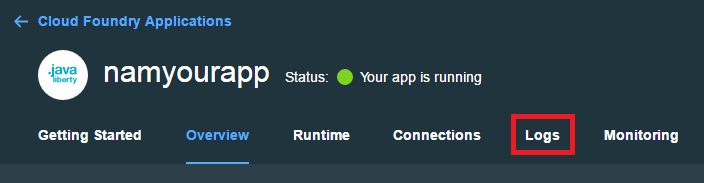

# Olivia Demonstrator

**Olivia** covers 3 main scenarios:

### Scenario 1: Conversation - Natural language conversation
The conversation service enables the creation of a cognitive agent (bot). Once its setup it can answer users questions based on identified **Intents** (using machine learning) and **Entities** (key words).
This service is best used to handle a limited / known scope (Fat Head questions / FAQ). It should be configured for each new project.
For instance, first applications built on top of this framework : 
* An IT Support Assistant for a A&D Company, able to manage several ALM Applications
* A second application for HR processes

### Scenario 2: Retrieve and Rank - Smart search for Long Tail questions
To adress a largest scope (non-frequent questions), the framework is linked to a R&R service. It can provide the users with the most relevent answers from its corpus.
Retrieve and Rank's corpus can be crawled directly from a web page, or uploaded manually through the Answer Store or R&R tooling.

### Scenario 3: Forum Post - Publishing questions that Watson can't handle directly on a forum
If the provided answers (through Conversation and R&R) don't satisfy the users. Watson offers to post the request on a community or forum, so other users can answer.
Slack is an example of a community that can be used for this purpose.

Olivia has also been granted the ability to speak (Text to Speech) and hear (Speech to Text) thanks to watson services.

[See the app demo]: https://olivia.w3ibm.mybluemix.net/ .

### Optional Linked Applications
The **Answer Store** is a user friendly UI meant to help the authoring-user to manage and upload aswer units to R&R.
Since the **Olivia** framework supports PDF display as well, the **Answer Store** can be used to replace Conversation plain-text answers by PDFs or embeded web pages.

For more informations please visit : https://github.ibm.com/CognitiveAssetFactory/CogAss-AnswerStore

# Simplified Use Case

# Architecture Overview

The application consists of 2 core layers:
* Custom Developed Application
* Watson Developper Cloud Services

### Applications Layer

### Services Layer

1 Conversation, see the [detailed documentation] : http://www.ibm.com/watson/developercloud/conversation.html .

2 Retrieve and Rank, see the [detailed documentation] : https://www.ibm.com/watson/developercloud/retrieve-rank.html .

3 Document Conversion, see the [detailed documentation] : https://www.ibm.com/watson/developercloud/document-conversion.html .

4 Cloudant, see the [detailed documentation] : https://console.ng.bluemix.net/docs/#services/Cloudant/index.html#Cloudant .

5 Text to Speech, see the [detailed documentation] : https://www.ibm.com/watson/developercloud/text-to-speech.html .

6 Speech to Text, see the [detailed documentation] : https://www.ibm.com/watson/developercloud/speech-to-text.html .

# Deployment and continuous integration

**In order to deploy and run this app, you must have a Bluemix account and run some steps within Bluemix. The following guide deals with the conversation service but the same should be done to setup the other Watson services.**

### Service Credentials

1 Go to the Bluemix Dashboard and select the Conversation service instance. Once there, select the **Service Credentials** menu item.

&nbsp;&nbsp;&nbsp;&nbsp;&nbsp;&nbsp;&nbsp;&nbsp;&nbsp;&nbsp;&nbsp;&nbsp;

2 Select **ADD CREDENTIALS**. Name your credentials then select **ADD**.

3 Copy the credentials (or remember this location).

4 Open the app.js file and locate the SERVICE WRAPPER for Conversation.

5 Replace the service credentials with the ones you've created earlier.

Note : You can also provide the service credentials for the app by using environment variables. You can check the "Adding environment variables in Bluemix" section.

### Import a workspace (Conversation)

To use the app you're creating, you need to add a worksapce to your Conversation service. A workspace is a container for all the artifacts that define the behavior of your service (ie: intents, entities and chat flows). For this sample app, a workspace is provided.

For more information on workspaces, see the full  [Conversation service  documentation](https://www.ibm.com/smarterplanet/us/en/ibmwatson/developercloud/doc/conversation/overview.shtml).

1 Navigate to the Bluemix dashboard, select the Conversation service that you created.

2 Go to the **Manage** menu item and select **Launch Tool**. This opens a new tab in your browser, where you are prompted to login if you have not done so before. Use your Bluemix credentials.

3 If you are deploying through Bluemix, download the [exported JSON file](https://raw.githubusercontent.com/watson-developer-cloud/conversation-simple/master/training/car_workspace.json) that contains the Workspace contents. If deploying locally,  this was cloned and is in the training folder (training/car_workspace.json).

4 Select the import icon: . Browse to (or drag and drop) the JSON file. Choose to import **Everything(Intents, Entities, and Dialog)**. Then select **Import** to finish importing the workspace.

5 Refresh your browser. A new workspace tile is created within the tooling. Select the _menu_ button within the workspace tile, then select **View details**:

&nbsp;&nbsp;&nbsp;&nbsp;&nbsp;&nbsp;&nbsp;&nbsp;&nbsp;&nbsp;&nbsp;&nbsp;

In the Details UI, copy the 36 character UNID **ID** field. This is the **Workspace ID**.

&nbsp;&nbsp;&nbsp;&nbsp;&nbsp;&nbsp;&nbsp;&nbsp;&nbsp;&nbsp;&nbsp;&nbsp; 

6 Return to the deploy steps that you were following:
- For Local - [return to step 2](#returnlocal)
- For Bluemix - [return to step 5](#returnbluemix)

### Adding environment variables in Bluemix

1 In Bluemix, open the application from the Dashboard. Select **Environment Variables**.

2 Select **USER-DEFINED**.

3 Select **ADD**.

4 Add a variable with the name **WORKSPACE_ID**. For the value, paste in the Workspace ID you [copied earlier](#workspaceID). Select **SAVE**.

&nbsp;&nbsp;&nbsp;&nbsp;&nbsp;&nbsp;&nbsp;&nbsp;&nbsp;&nbsp;&nbsp;&nbsp;

5 Restart your application.

### Troubleshooting in Bluemix

#### In the Classic Experience:
- Log in to Bluemix, you'll be taken to the dashboard.
- Navigate to the the application you previously created.
- Select **Logs**.

&nbsp;&nbsp;&nbsp;&nbsp;&nbsp;&nbsp;&nbsp;&nbsp;&nbsp;&nbsp;&nbsp;&nbsp;

- If you want, filter the LOG TYPE by "APP".

&nbsp;&nbsp;&nbsp;&nbsp;&nbsp;&nbsp;&nbsp;&nbsp;&nbsp;&nbsp;&nbsp;&nbsp;

#### In the new Bluemix:
- Log in to Bluemix, you'll be taken to the dashboard.
- Select **Compute**

&nbsp;&nbsp;&nbsp;&nbsp;&nbsp;&nbsp;&nbsp;&nbsp;&nbsp;&nbsp;&nbsp;&nbsp;

- Select the application you previously created.
- Select **Logs**.

&nbsp;&nbsp;&nbsp;&nbsp;&nbsp;&nbsp;&nbsp;&nbsp;&nbsp;&nbsp;&nbsp;&nbsp;

- If you want, filter the Log Type by selecting the drop-down and selecting **Application(APP)**.

&nbsp;&nbsp;&nbsp;&nbsp;&nbsp;&nbsp;&nbsp;&nbsp;&nbsp;&nbsp;&nbsp;&nbsp;
